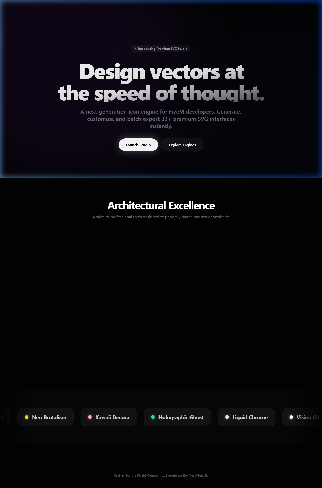
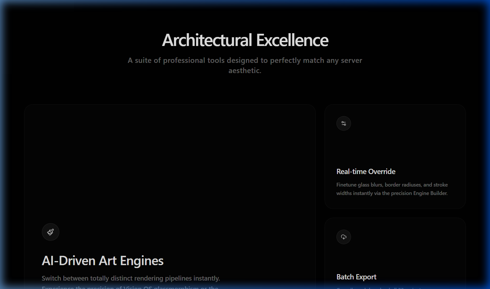
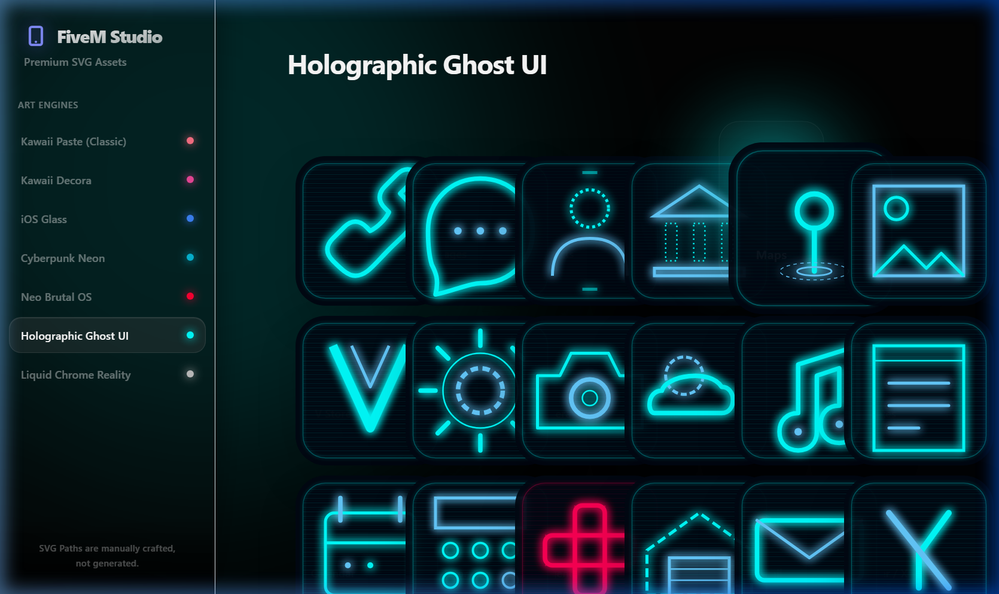
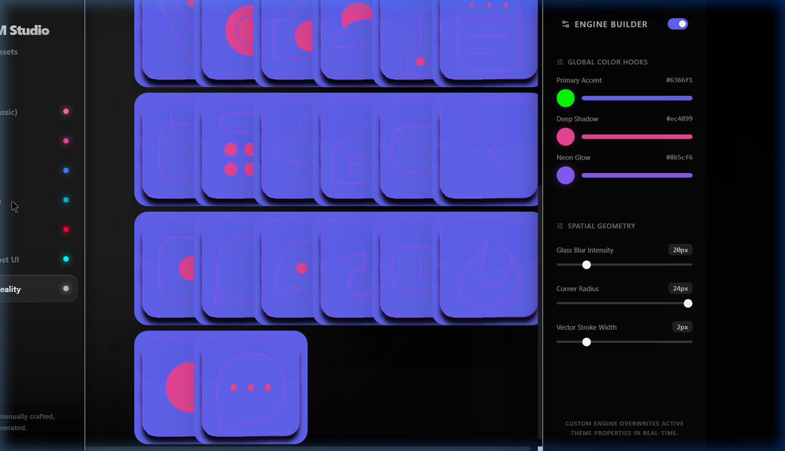

<div align="center">
  
  
  <br />
  
  <h1>FiveM Icon Studio (2026 Spatial Edition)</h1>
  <p>An autonomous, premium vector engineering platform for FiveM smartphone developers.</p>

  <br />

  
</div>

<br />

## 🪐 Architectural Excellence

FiveM Icon Studio is an advanced, production-grade web application tailored explicitly for FiveM server ecosystem. Instead of relying on static PNGs or bulky icon packs, the Studio provides **pure, mathematically precise SVG geometry** generated entirely natively.

Every icon is built structurally to allow infinite resolution scaling and perfect pixel-alignment. The studio is architected with a strictly enforced "Calm, Human, Premium, and Timeless" design language, bringing a massive upgrade to high-end FiveM phone UIs (like `qs-smartphone`, `qb-phone`, `lb-phone`).



---

## 🔥 Enterprise Grade Rendering Engines

The Studio dynamically replaces React instantiation trees with custom `.jsx` Engine modules containing highly optimized SVG structures. 

### 1. Vision OS (Glassmorphic Reality)
Simulates extreme legibility utilizing high-opacity white bases layered intricately with deep `#000` multi-stage `feDropShadow` arrays mapping absolute hierarchy. Bright brand identifier colors (like Maps red and Phone green) are softened using sub-opacity layering allowing the background ambient "room" colors to pull directly through.

### 2. Carbon Tactical HUD
Engineered to serve raw SVG shapes meticulously aligned to simulate military diagnostic interfaces. Utilizing a deep `#0a0d0b` dark drab base enveloped by intense `#4ade80` neon green dashed telemetry borders and intersecting `#f97316` orange crosshairs. 

### 3. Vice City Synthwave
Constructed to render an immersive 80s Outrun aesthetic across the grid. Features a deep `#120428` to `#2a0b59` linear gradient representing the night sky, and `#ff007f` to `#ff7f00` sunset `<circle>` paths natively generated behind the icons.

### 4. Liquid Chrome & Neo Brutalism
From viscous liquid metal displacement maps (`feTurbulence`) to stark, thick-bordered flat design patterns.

---

## ⚡ Real-Time Physics & Spatial UX

The UI extends beyond a standard web application, acting as a spatial canvas.



*   **Framer Motion 3D Physics:** Hardware-accelerated `useMouseTilt` parallax grid effects track precise `clientX/Y` physics instantly over a 25-degree rotation plane.
*   **Web Audio Synthetics:** Fully procedurally generated synthetic oscillators (bypassing heavy `.mp3` dependencies) to emit deep navigational 150Hz triangle sine-wave thuds and high-pitch hover ticks for instant haptic feedback.
*   **Ambient Cascades:** The main application background features massive, blurred floating `motion.div` orbs that pull their exact hex colors from the active semantic theme's configuration, dynamically bathing the environment in light depending on the Engine selected.

---

## 🛠️ Dynamic Override & Asset Generation

### Precision Custom Engine Builder
Bypass the preset values. Utilize the Engine Builder to inject DOM string overrides directly into the active SVG pipeline rendering. Dynamically shift primary, secondary, and accent colors, as well as corner radiuses (squircles) and glassmorphism blur filters over 33 massive geometry outputs.



### Batch Compilation Export
Don't waste time downloading components one by one. The `jszip` memory-buffer generation engine instantly loops over all dictionary elements, executes standard regex compilation injecting your active Custom Engine settings, and instantly forces a `theme-bundle.zip` download directly locally. All without a server request.

---

## 💻 Technical Infrastructure

*   **Framework:** React 18 + Vite (Minimal Overhead build pipelines)
*   **Motion Architecture:** `framer-motion` (Spring Physics & spatial routing via `AnimatePresence`)
*   **Styling Engine:** Vercel-Pattern TailwindCSS v3 (Strict deep monochrome palettes `#0A0A0A`, sub-opacity borders, glassmorphism filters, zero visual noise).
*   **Typography:** Strict `Inter` sans-serif layout, high contrast readability.
*   **Iconography:** `lucide-react` precision vector strokes.
*   **Buffer Processing:** `jszip` and custom `navigator.clipboard` geometry extractions.
*   **Browser Support:** Webkit / Chrome / Edge Evergreen

---

## 🚀 Installation & Launch

```bash
# Clone the Core
git clone https://github.com/whiteexcellent/iconcreater.git

# Install strictly standard dependencies
cd iconcreater
npm install

# Ignite Local Spatial Server
npm run dev
```
